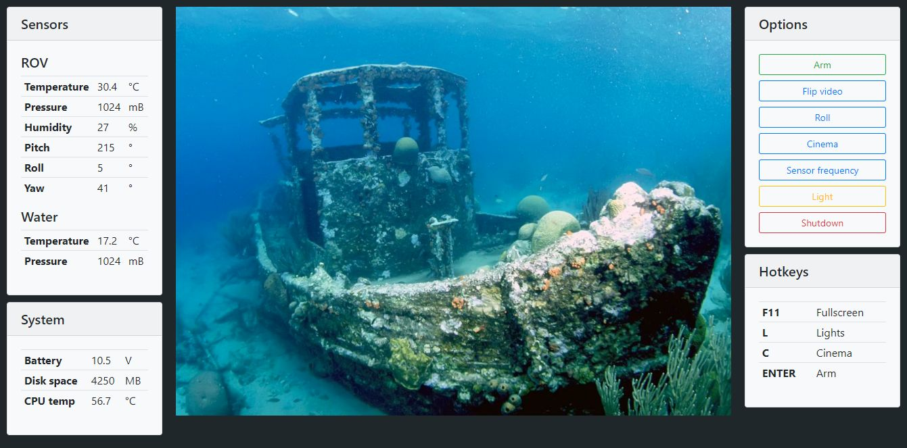
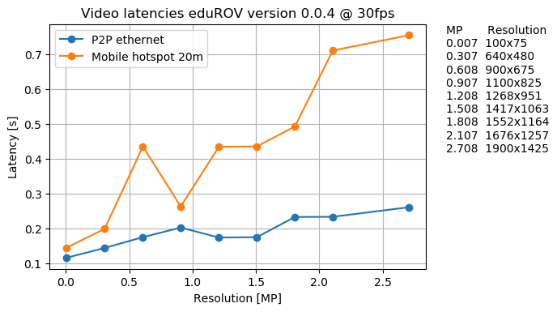

**********************************************
eduROV - Educational Remotely Operated Vehicle
**********************************************

Stream camera feed from a Raspberry Pi camera to any web browser on the network.
Control the robot with your keyboard directly in the browser.

The eduROV project is all about spreading the joy of technology and learning.
The eduROV is being developed as a DIY ROV kit meant to be affordable and
usable by schools, hobbyists, researchers and others as they see fit.
We are committed to be fully open-source, both software and hardware-wise,
everything we develop will be available to you. Using other open-source and or
open-access tools and platforms.

:GitHub: https://github.com/trolllabs/eduROV
:PyPI: https://pypi.org/project/edurov/
:Documentation: http://edurov.readthedocs.io
:Engage eduROV: https://www.edurov.no/

Main features
=============

1. **Low video latency**

   You can stream HD video from the Raspberry Pi camera to any unit on the same
   network with a video delay below 200ms.

2. **No setup required**

   The package works by displaying the video feed and other content in a web
   browser. This means that you can use any device to display your interface.

3. **Very easy to use**

   With the exception of Pyro4 (which is installed automatically), edurov
   doesn't require any other packages or software. Everything is written in
   python and html. 4 lines of code is everything needed to get started!

4. **Highly customizable**

   Since you define the html page yourself, you can make it look and work
   exactly the way you want. Use css and javascript as much as you want.

5. **True parallelism**

   Need to control motors, read sensor values and display video feed at the
   same time? edurov can spawn your functions on multiple CPU cores while still
   maintaining the possibility to share variables.

Prerequisites
=============
- eduROV requires python 3, if you don't have python installed, you can
  download it here: https://www.python.org/downloads/
- the camera on the raspberry pi has to be enabled, see
  https://www.raspberrypi.org/documentation/configuration/camera.md

Installation
============
Run the following commands in a terminal on the Raspberry Pi.::

  sudo pip3 install edurov

For a more in depth description visit
`the official documentation <http://edurov.readthedocs.io/>`_.

Usage
=====

Engage eduROV submersible
-------------------------

On the Raspberry Pi, run the following command::

  edurov-web

This will start the web server and print the ip where the web page can be
viewed, e.g. ``Visit the webpage at 192.168.0.197:8000``.

Create your own
---------------

The eduROV package includes multiple classes and functions to facilitate
easy robot communication with video feed. It will get you up and running in a
matter of minutes. Visit
`the official documentation <http://edurov.readthedocs.io/>`_ for a *getting
started*, examples and API.

Performance
===========
The eduROV package were created with a strong focus on keeping the latency at
a minimum. When deploying on a wireless network the actual performance will
vary depending on factors such as distance, interference and hardware.

Author
========
The package is created by Martin Løland as part of the master thesis at
Norwegian University of Science and Technology 2018
